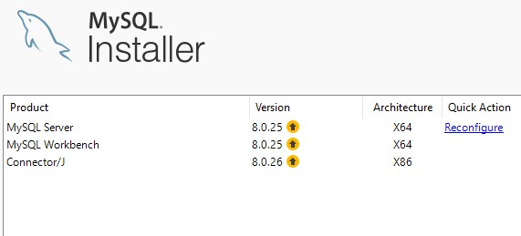
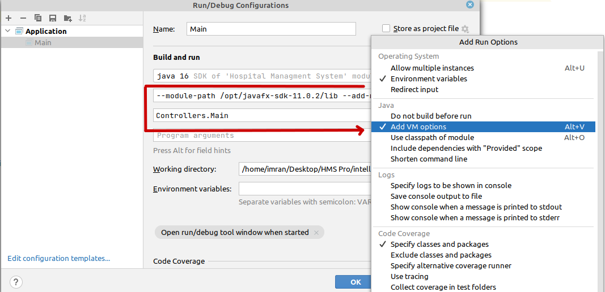
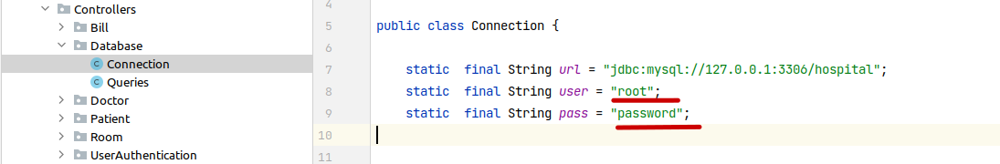
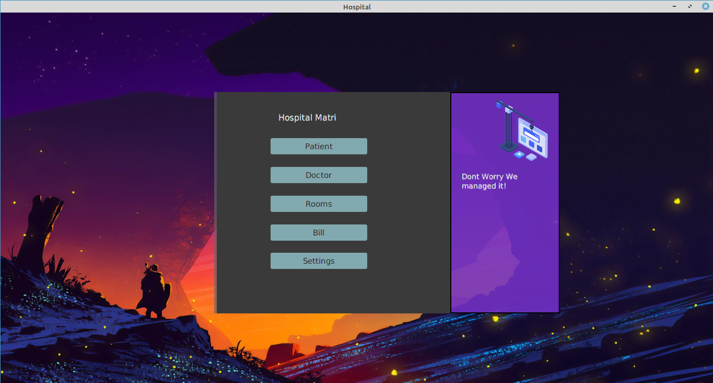
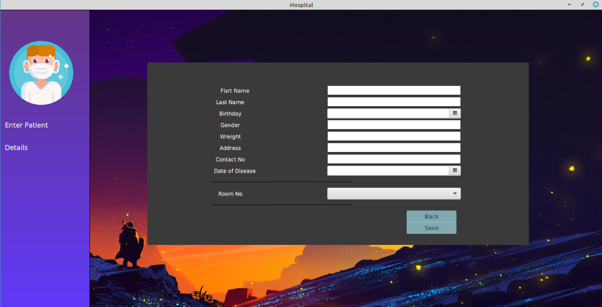
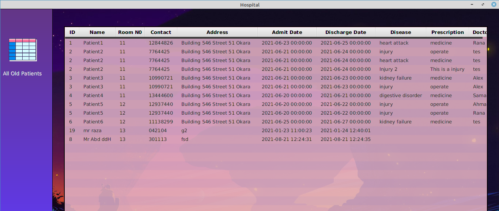

# Hospital Management System

<br>
<br>

## Description

Hospital Management System desktop app built using Java, JavaFX and SQL

## Getting Started

### Perquisites to use the app

- [IntelliJ IDEA](https://www.jetbrains.com/idea/download/#section=windows)
- [Java SE Development Kit 16.0.2](https://www.oracle.com/java/technologies/javase-jdk16-downloads.html) (can also be downloaded by IntelliJ itself)
- SQL
  - [MSql Community Server](https://dev.mysql.com/downloads/mysql/)
  - [SQL Workbench](https://dev.mysql.com/downloads/workbench/)
  - [Java Sql Connector](https://dev.mysql.com/downloads/connector/j/)
- [JavaFX 19](https://gluonhq.com/products/javafx/)

Note: If you are a windows user, you can simply install the [MySQL installer](https://dev.mysql.com/downloads/installer/) to download both the sql server and the worbench

- Install [MySQL installer](https://dev.mysql.com/downloads/installer/).
- Using installer install
  - MySql Server
  - MySql Workbench
  - Connector/j



## Configuring Workbench

Install the workbench using SQL installer as told above.

- Make a new SQL connection
- Set your username and password
- Now setup the whole database by running the `database/database.sql` script in the workbench.

## Configuring IntelliJ

- Install JavaFx then add to IntelliJ https://openjfx.io/openjfx-docs/#IDE-Intellij

- Add **sqlconnector** modules to the project structure by going

```
File -> ProjectStructure -> Libraries -> + -> java -> path_to_jarfile
```

- Make sure IntelliJ has detected the correct java SDK version. You can install java directly form the IntelliJ if not detected.
- You can configure this **javafx** project using this [documentation ](https://openjfx.io/openjfx-docs/#IDE-Intellij)



- Open the Connection.java file and enter your user and password.



- Default user and pass for the login page is `imran123 and 123456` respectively

### Overview




